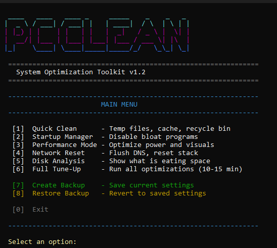

# PC Clean
A fancy terminal-based Windows optimization toolkit with a colorful UI.



---

## Project Status

✅ **Complete** - This tool is finished and does exactly what it's designed to do.

No roadmap. No feature bloat. Just a clean utility you can run and trust.

Bug reports welcome via [Issues](../../issues). Not actively adding new features.

---

## How to Download

1. Click the green **<> Code** button (top right of this page)
2. Click **Download ZIP**
3. Extract the ZIP file
4. Right-click `Run.bat` → **Run as Administrator**

That's it!

---

## Is This Safe?

**Yes.** But don't take my word for it - verify it yourself.

This script:
- ✅ Only deletes temporary/cache files that Windows regenerates automatically
- ✅ Does NOT modify system files
- ✅ Does NOT install anything
- ✅ Creates backups before making any changes
- ✅ Is fully open source - every line is readable

### How to Verify Safety

1. Open the `PCCleanup.ps1` file
2. Copy the entire code
3. Paste it into any AI assistant (ChatGPT, Claude, Grok, Gemini)
4. Ask: *"Is this script safe? Does it delete anything permanent? Any hidden risks?"*

The code is heavily commented in plain English so you (or the AI) can read exactly what every line does.

**This is how you should verify ANY script you download from the internet.**

---

## Features

| Feature | Description |
|---------|-------------|
| **Quick Clean** | Clears temp files, browser caches, recycle bin, Windows Update cache |
| **Startup Manager** | View and disable bloat programs that slow down boot time |
| **Performance Mode** | Sets High Performance power plan, disables transparency/animations, enables Game Mode |
| **Network Reset** | Flushes DNS, resets Winsock and TCP/IP stack |
| **Disk Analysis** | Visual drive usage bars + top 10 largest folders |
| **Full Tune-Up** | Runs everything including DISM component cleanup (10-15 min) |
| **Create Backup** | Saves current settings before optimization |
| **Restore Backup** | Reverts to your saved settings if needed |

---

## Quick Start

### How to Run

1. Download `PCCleanup.ps1` and `Run.bat`
2. Right-click `Run.bat` → **Run as Administrator**

That's it! Running as Administrator ensures all features work properly (Prefetch cleanup, DISM, network reset, system restore points).

### Alternative: PowerShell Direct

```powershell
Set-ExecutionPolicy -ExecutionPolicy Bypass -Scope Process
.\PCCleanup.ps1
```

---

## What's New in v1.2

- **Backup/Restore Manager** - Save your settings before optimizing, restore anytime
- **System Restore Point** - Option to create Windows restore point before Full Tune-Up
- **Auto-backup** - Full Tune-Up automatically saves your settings first
- **Better UX** - Press Enter to continue (instead of any key)

---

## License

MIT License - see [LICENSE](LICENSE)

**Use at your own risk.** While designed to be safe, always ensure you have backups of important data.
